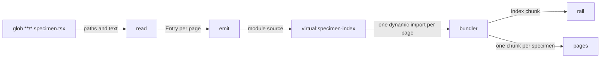
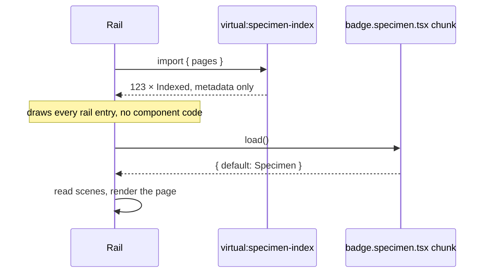
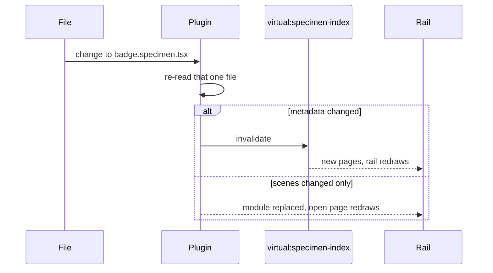

# RFC-0001: Index specimens without loading them

## Summary

Each component documents itself in a `*.specimen.tsx` file beside it, naming the page and listing
the scenes that show it. The catalogue draws its whole rail from metadata parsed out of that source
at build time, then loads a page's components when somebody opens it. Two packages carry the design:
`@stealthscale/foundation-specimen` holds the format a specimen is written in, and
`@stealthscale/vite-plugin-specimen` parses those files without executing them and hands the
catalogue an index.

## Motivation

Fifteen component packages are being built here, from `access` through `typography`. A component
library that nobody can look at is a library nobody trusts, so each component needs a page showing
it in its states, and that page has to sit beside the component rather than in a catalogue
somewhere else — otherwise it is the thing that stops being updated.

A file exports the page's name and the scenes that draw it, and a catalogue globs those files, reads
each export and renders a rail — the obvious shape, and the one a proof of concept in
`foundations/specimen` already has, with 123 specimen files written against it. That is enough of it
built to see where it goes wrong.

A rail cannot list a page until it knows the name, the name is a property of an object the module
returns, so the module has to run — and running it pulls in the component, the component's
dependencies, and Chakra and Ark behind them. Opening one page loads all 123, in a single chunk,
because nothing in the graph is reachable any other way. The cost tracks the size of the library
rather than what anyone asked to see, and it rises with every component added.

Two facts are stuck together that do not belong together. A page's name is a string, and source text
holds it. A page's drawing is a component, and only running the module produces it. The rail needs
the first for 123 pages and the second for the one page on screen.

Pulling the name out of source text needs the source text, which the build has and a browser never
receives. A bundler plugin can therefore do it and the package holding the format cannot — the same
reason a glob has to appear as a literal in the file that declares it, since the bundler expands it
before anything runs.

## Detailed design

### The specimen format

Two types, in `@stealthscale/foundation-specimen`:

```ts
import { type FC } from "react";

/**
 * Shows one thing, under a caption saying what it is.
 */
export interface Scene {
  /**
   * What this scene shows, where the title alone does not say it.
   */
  about?: string;

  /**
   * Draws it, as a component rather than a plain function, so that a scene holding state declares
   * its hooks in its own render rather than in whatever drew it.
   */
  draw: FC;

  /**
   * What it is called, as the caption over it.
   */
  title: string;
}

/**
 * Declares one page, saying where it belongs and what is on it.
 */
export interface Specimen {
  /**
   * What the page opens on, in a sentence or two.
   */
  about?: string;

  /**
   * Which group the rail lists it under. Left out, it is listed on its own.
   */
  group?: string;

  /**
   * What addresses the page, and what an i18n catalogue keys its words by.
   *
   * Stable and never displayed, so a title can be rewritten or translated without a link moving.
   * Unique across the catalogue. Two pages sharing an identifier resolve to one address, and the
   * second is unreachable.
   */
  id: string;

  /**
   * What is on the page, in the order it is drawn.
   *
   * Listed rather than gathered from the file's own exports, because a module hands its names back
   * alphabetically. A page written Variants, States, Anatomy would be read back Anatomy, States,
   * Variants, in every catalogue built on it.
   */
  scenes: readonly Scene[];

  /**
   * What it is called. Left out, it is read from the last part of the identifier.
   */
  title?: string;
}

/**
 * States what a page is.
 *
 * A function rather than a bare object, so what a specimen may declare is checked where it is
 * written rather than wherever a catalogue happens to read it.
 *
 * @param page - Everything the page declares about itself.
 * @returns The same, checked.
 */
export function specimen(page: Specimen): Specimen;
```

A path hints at where a page belongs and says neither what it is called nor what is on it, which is
why every field is stated rather than derived from one. One repository keeps a package per directory
and another keeps everything under `src`, so a rule written for the first is quietly wrong for the
second.

A specimen file's default export is a `Specimen`. Nothing else about the file is read.

### Parsing a specimen into an entry

Producing the index and emitting it are separate. Reading answers metadata and names no destination
for it:

```ts
/**
 * One specimen file, as the reader takes it.
 */
export interface Source {
  /**
   * Where the file is, absolute.
   */
  path: string;

  /**
   * Its text, unparsed.
   */
  text: string;
}

/**
 * One page, as a rail knows it before anything is loaded.
 */
export interface Entry {
  /**
   * What the page opens on. Empty where the page said nothing.
   */
  about: string;

  /**
   * Which group the rail lists it under. Empty where the page named none.
   */
  group: string;

  /**
   * What addresses the page.
   */
  id: string;

  /**
   * Where the file is, which is what the emitted loader imports.
   */
  path: string;

  /**
   * What it is called, derived from the identifier where the page stated none.
   */
  title: string;
}

/**
 * Reads specimen files into the pages an index lists.
 *
 * Answers the pages rather than writing them, so one reading serves the virtual module this
 * proposal emits and whatever destination another proposal adds.
 *
 * @param files - Every file the glob matched.
 * @returns One entry per readable page, in the order given.
 * @throws Error Where a page states metadata the source does not hold as a literal.
 */
export function read(files: readonly Source[]): readonly Entry[];
```

`oxc-parser` is the Node binding for the parser oxlint and oxfmt are built on. Those two embed it
rather than importing it, so this is a dependency the repository does not already carry. It reads
TSX directly:

```ts
import { parseSync } from "oxc-parser";

const result = parseSync(path, source, { lang: "tsx" });
```

`parseSync` answers a `ParseResult` carrying `program`, `module`, `comments` and `errors`. The
reader walks `program` for the default export, confirms it is a call with one object-literal
argument, and lifts `about`, `group`, `id` and `title` where each is a string literal.

Where a page names no group and opens on nothing, both read as empty strings, `id` being the one
field it has to state. A page that states no title is called after the last part of its identifier.

The reader lifts no scenes, and that omission is the point of the design. A scene holds the
component this whole proposal exists to keep out of the index chunk, and a component is not
something source text can hand over.

### The virtual module

One virtual module, `virtual:specimen-index`:

```ts
/**
 * One page, as the rail lists it, with the means to open it.
 */
export interface Indexed extends Entry {
  /**
   * Loads the module, which is where the scenes are.
   *
   * A dynamic import, so the bundler splits the page into a chunk of its own and keeps everything
   * it imports out of the chunk holding this index.
   */
  load: () => Promise<{ default: Specimen }>;
}

/**
 * Lists every page found, in the order the glob matched.
 */
export const pages: readonly Indexed[];
```

`load` is absent from what `read` answers, because a loader is generated code rather than something
read out of a file. The plugin adds one per page when it writes the module.

`pages` is the concatenation of the index sources the plugin was given, which is one today. A
catalogue built from installed packages would add sources rather than change how they are read.

Neither seam is free of judgement — they are a function boundary and an array, sized for a use
nobody has asked for. They are here because the alternative is reopening the emit path, which
everything else in the plugin depends on.

### Building an index



The bundler sees 123 dynamic imports in the emitted module and splits a chunk behind each. Nothing a
specimen imports can reach the index chunk, because the only edge into it is a dynamic one.

### Opening a page



### Editing a specimen



Re-reading one file is what makes this cheap in the loop where it runs most. A change to a scene
leaves the index alone and redraws the open page; a change to `id`, `group`, `title` or `about`
costs a redraw of the rail as well.

### A specimen the reader cannot read

The metadata has to be a literal. `specimen({ id: "components/alert" })` parses;
`specimen({ id: idFor(name) })` does not, and a page whose identifier is only knowable at run time
cannot be listed without loading it, which is the thing this proposal exists to avoid.

Such a file is an error, and what reports it depends on what the bundler is doing, which
`configResolved` tells the plugin:

- Building: the plugin throws, naming the file and the field. The build stops.
- Serving: the plugin indexes the page under its filename and gives it a `load` that throws the
  parse error. The rail lists it, opening it shows the error, and the other 122 pages work.

Failing the whole index while serving would take the catalogue dark because one file is mid-edit,
which is the wrong trade in the loop where files are mid-edit most often.

Two pages sharing an identifier is the same error, reported the same way. The failure it produces
otherwise — two pages at one address, only the first reachable — is silent.

## Alternatives considered

### Use Storybook

It solves this problem, a great many people have tested it, and it comes with controls, addons, a
docs mode and accessibility checks nobody here has written.

**Why not:** it brings its own build. The toolchain here composes a Vite+ config out of layers, and
Storybook adds a second configuration surface that has to agree with the first about aliases,
conditions, the JSX transform and the styling factory — an agreement nothing checks. Its format is
also larger than the problem. A specimen states an identifier, a group, a sentence or two and a list
of scenes, where Component Story Format carries args, argTypes, decorators, play functions and
parameters, and every one of those is a difference somebody here maintains an opinion about. This is
123 pages of a design system rather than a product with an unbounded catalogue.

### Let the catalogue glob eagerly and accept one bundle

`import.meta.glob` with `eager: true` answers every module, and a catalogue reads titles and scenes
straight off them in a few lines, using nothing the repository does not already have.

**Why not:** it is the shape the proof of concept has, and it is what forces all 123 components into
the first download. The number grows with every component package added and never with what a reader
opened.

### Glob lazily and leave it there

`import.meta.glob` without `eager` answers `Record<string, () => Promise<unknown>>`, and the bundler
splits a chunk per file from those dynamic imports. It costs one word and keeps every dependency the
repository already has.

**Why not:** it repairs the bundle and leaves the rail where it was. A module still defines its own
title, so listing 123 pages means loading 123 modules, and the catalogue shows an empty rail that
fills in as they arrive. One large download becomes 123 smaller ones arranged in series, which the
reader waits on for longer.

### Generate the index into a checked-in file

A script walks the specimens and writes `specimens.generated.ts`, which a catalogue imports like any
other module. The plugin hooks disappear, and the index becomes a file somebody can open and read.

**Why not:** the file is a second copy that drifts between runs, and it drifts quietly — a specimen
added without rerunning the script is absent from the rail and nothing reports it. Correctness then
depends on somebody running the generator after every change, which is the part a plugin does
without being remembered.

### Put the plugin in the toolchain repository

`@stealthscale/vite-plugin-sbom` and `@stealthscale/vite-plugin-base` already live there, and a
third plugin beside them is where a reader would look.

**Why not:** the direction of dependency forbids it. This repository depends on the toolchain, and
the plugin's entire job is knowing what a specimen is — which import declares it, which fields are
metadata, and which field the bundler must leave unloaded. Making it generic enough to sit upstream
means configuration invented for one caller, and the shape it emits is this repository's shape
regardless.

## Drawbacks

**Two packages to own rather than one.** The plugin adds `package.json`, `tsconfig.json`,
`vite.config.ts`, `README.md` and four source files, of which two are specifications. Eight files,
and a release whenever the format changes.

**A new dependency.** `oxc-parser` at `0.149.0`, which carries 19 optional platform binaries. It
depends on `@oxc-project/types` at `^0.149.0`, and `vite-plus@0.3.1` pins the same package at
`=0.148.0`, so a workspace installing both holds two copies. Neither reaches a bundle, being types,
but an AST typed against one version and walked against the other is a mismatch nothing reports.

**Metadata has to be literal, and a build fails when it is not.** A specimen that computes its
identifier is legal TypeScript and legal against the `Specimen` type, and it stops the build. The
type system cannot express the constraint, so the only thing stating it is the error.

**A page's name exists twice at run time.** The index carries it, and the loaded module carries it
again, because `specimen()` takes one object for both. The second copy is a few strings per page and
nothing reads it.

**Chunk count.** 123 specimens become at least 123 chunks. What they share is hoisted, but a
catalogue that opens ten pages makes ten requests.

**A parser walk to maintain.** The reader depends on the shape of an oxc AST, and an oxc upgrade can
change it. A specification over fixture strings catches that, and somebody still has to fix it.

## Open questions

Should the plugin take the glob pattern as an option, or fix it at `**/*.specimen.tsx`?

What does the plugin do with a `*.specimen.tsx` whose default export is not a call at all — treat it
as a file that claimed to be a specimen and failed, or as a file that is not one?

Is `virtual:specimen-index` the right granularity, or should a rail be able to ask for one group at a
time?

Does the `@oxc-project/types` skew matter in practice, or does pinning `oxc-parser` to the version
the toolchain already carries avoid it entirely?

Does `foundation-specimen` need a runtime path that takes evaluated modules, for a consumer who
wants a catalogue without the plugin?

## Unresolved and future work

Publishing specimens so a consumer can render the catalogue for the packages they installed is not
proposed here, and three things refuse it today. Every component package declares `files: ["dist"]`,
so specimens never enter a tarball. A specimen reaches its component through a `#` subpath that
`imports` maps under `./src/`, so publishing the source alone leaves that import unresolved in an
install. A bundled specimen cannot be parsed for its metadata either, so a package that published
one would have to emit its own index while packing.

The two seams are what this proposal carries for that case. A published index is another destination
for the reading and another source for the concatenation, both of which already exist. Three
questions are left open by that and answered nowhere here: which export entry a consumer looks for,
what semver obligations the format takes on, and how much larger a component package becomes.

Extracting the reader into a format-agnostic package is not proposed here. One caller is not enough
to design an interface against.

The catalogue application itself is not proposed here. This describes what it is handed.

## References

| What | Where |
|---|---|
| `oxc-parser` API, `parseSync` and `ParseResult` | `node_modules/oxc-parser/src-js/index.d.ts` at 0.149.0 |
| Component Story Format, and the size of its contract | https://storybook.js.org/docs/api/csf |
