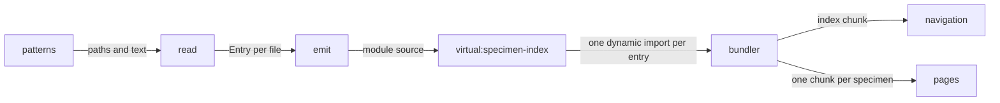
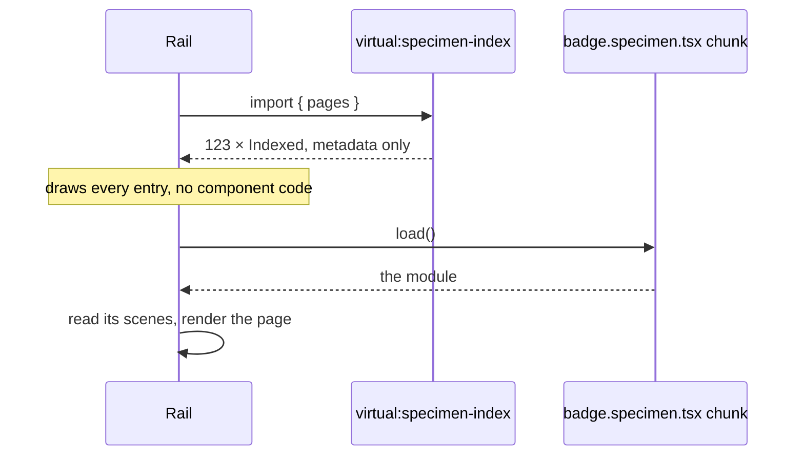
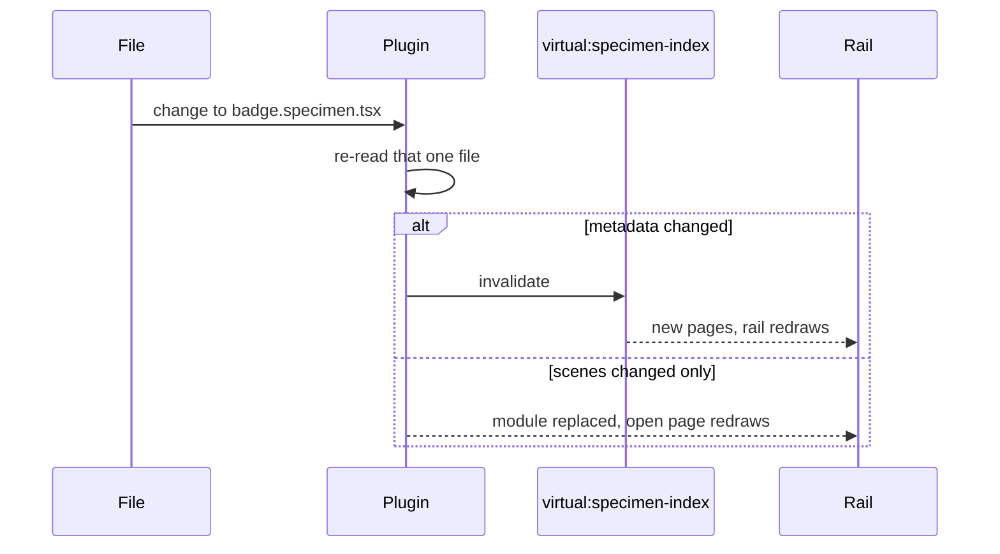

# RFC-0001: Index specimens without loading them

## Summary

`@stealthscale/vite-plugin-specimen` finds every `*.specimen.tsx` matching the patterns it is given,
reads each one's metadata out of the source without executing it, and emits a virtual module holding
that metadata beside one dynamic import per file. A catalogue draws its whole navigation from the
metadata and loads a page's components when somebody opens it.

## Motivation

One obvious approach globs the 123 specimen files, imports each one and reads what it exported.
Every import pulls in the component the file documents, that component's dependencies, and Chakra
and Ark behind them, so listing the navigation costs the entire component library before anything
appears.

Two facts are stuck together that do not belong together. A page's name is a string that the source
text already holds. A page's drawing is a component that only running the module produces. A
navigation rail needs the first for all 123 pages and the second for the single page on screen.

Separating them needs the source text, which the build has and a browser never receives, so a
bundler plugin can do it and a package that runs in a browser cannot. The same constraint is why
`import.meta.glob` takes a literal pattern: the bundler expands it before anything runs.

## Detailed design

### The plugin's options

```ts
/**
 * Configures a specimen index.
 */
export interface Options {
  /**
   * Where to look, as globs resolved against the project root.
   *
   * More than one, because a catalogue gathers directories that share no parent, and because a
   * pattern pointing into `node_modules` is how an installed package's specimens would be found.
   */
  patterns: readonly string[];
}

/**
 * Indexes specimens, and emits that index as a virtual module.
 *
 * @param options - Where to look. `Options` documents every member.
 * @returns The plugin, as any Vite or rolldown build takes one.
 */
export function specimenIndex(options: Options): Plugin;
```

Nothing is assumed about where specimens live. A catalogue in this repository points at
`components/*/src/**/*.specimen.tsx`; a catalogue elsewhere points somewhere else.

### The three conditions

The plugin reads a file it has never executed, so what it can rely on is what the source says
literally. Three conditions, and a file matching a pattern has to meet all of them:

- Its default export is a call.
- That call takes one argument, an object literal.
- That object holds `id` as a string literal.

`group`, `title` and `about` are read where each is a string literal, and read as empty otherwise.

Neither the name of the function being called nor where it was imported from is checked. The parser
does report that — `ParseResult.module` carries `staticImports`, so tracing the callee back to its
binding is available — but the three conditions already refuse everything the index cannot use, and
a binding check buys a better error message at the price of an import specifier the plugin would
then have to be told.

Scenes are not read at all. A scene holds a component, and a component is not something source text
hands over — which is the whole reason the index can be cheap.

### Parsing

Vite re-exports the parser rolldown already uses, so the plugin adds no parser of its own:

```ts
import { parseSync, Visitor } from "vite";

const parsed = parseSync(path, text, { lang: "tsx" });
```

`parseSync` answers a `ParseResult` carrying `program`, `module`, `comments` and `errors`, and
`Visitor` walks the program. Both come from `rolldown/utils` through Vite's own entry point, which
means the AST and the parser that produced it are the same build by construction.

`parseAst` and `parseAstAsync` are exported alongside them and carry
`@deprecated - use parseSync instead`, so this uses the current entry rather than the compatibility
one.

### The reading, and where it goes

Producing the index and emitting it are separate:

```ts
/**
 * One specimen file, as the reader takes it.
 */
export interface Source {
  /**
   * Where the file is, absolute.
   */
  path: string;

  /**
   * Its text, unparsed.
   */
  text: string;
}

/**
 * One page, as a navigation rail knows it before anything loads.
 */
export interface Entry {
  /**
   * What the page opens on. Empty where the file stated none.
   */
  about: string;

  /**
   * Which group a rail lists it under. Empty where the file stated none.
   */
  group: string;

  /**
   * What addresses the page.
   */
  id: string;

  /**
   * Where the file is, which is what the emitted loader imports.
   */
  path: string;

  /**
   * What it is called, taken from the last part of the identifier where the file stated none.
   */
  title: string;
}

/**
 * Reads specimen files into the entries an index lists.
 *
 * Answers the entries rather than writing them, so one reading serves the virtual module this
 * proposal emits and whatever destination another proposal adds.
 *
 * @param files - Every file the patterns matched.
 * @returns One entry per file, in the order given.
 * @throws Error Where a file does not meet the three conditions, naming the file and the condition.
 */
export function read(files: readonly Source[]): readonly Entry[];
```

### The virtual module

```ts
/**
 * One page, as a rail lists it, with the means to open it.
 */
export interface Indexed extends Entry {
  /**
   * Loads the module holding the scenes.
   *
   * A dynamic import, so the bundler splits the file into a chunk of its own and keeps everything
   * it imports out of the chunk holding this index.
   */
  load: () => Promise<unknown>;
}

/**
 * Lists every page found, in the order the patterns matched.
 */
export const pages: readonly Indexed[];
```

`load` is absent from what `read` answers, a loader being generated code rather than something read
out of a file. The plugin adds one per entry when it writes the module.

`pages` is the concatenation of the index sources the plugin was given, which is one today. An index
arriving from somewhere other than a glob would add a source rather than change how entries are
read.

Groups are not split across indexes. A rail that wants its groups derives them from what it already
holds, and asking for one group at a time would need an index of the groups — a second artifact,
built and kept current to save a fraction of an index that is metadata only. At roughly 230 bytes an
entry, 123 of them are about 28KB before compression, against 100KB and upwards for a single
component chunk.

### Building an index



The bundler sees one dynamic import per entry in the emitted module and splits a chunk behind each.
Nothing a specimen imports enters the index chunk, the only edge into it being a dynamic one.

### Opening a page



### Editing a specimen



Re-reading one file is what makes this cheap in the loop where it runs most. A change to a scene
leaves the index alone and redraws the open page; a change to `id`, `group`, `title` or `about`
costs a redraw of the rail as well.

### A file the reader refuses

A file matching a pattern claimed to be a specimen, so failing any of the three conditions is an
error rather than a reason to skip it. A page whose identifier is computed cannot be listed without
loading it, which is the thing this proposal exists to avoid.

What reports the error depends on what the bundler is doing, which `configResolved` tells the
plugin:

- Building: the plugin throws, naming the file and the condition. The build stops.
- Serving: the plugin indexes the file under its filename and gives it a `load` that throws. The
  rail lists it, opening it shows the error, and every other page works.

Failing the whole index while serving would take the catalogue dark because one file is mid-edit,
which is the wrong trade in the loop where files are mid-edit most often.

Two files sharing an identifier is the same error, reported the same way. The failure it produces
otherwise is silent: two pages at one address, and the second unreachable.

A pattern matching no file at all is an error in both modes. One unreadable file leaves a catalogue
worth opening, so serving it degrades; a pattern matching nothing leaves no pages, which is a
mistyped pattern rather than a catalogue.

## Alternatives considered

### Use Storybook

It solves this problem, a great many people have tested it, and it arrives with controls, addons, a
docs mode and accessibility checks nobody here has written.

**Why not:** it brings its own build. The toolchain here composes a Vite+ config out of layers, and
Storybook adds a second configuration surface that has to agree with the first about aliases,
conditions, the JSX transform and the styling factory — an agreement nothing checks. Its format is
also larger than the problem. A specimen states an identifier, a group, a sentence or two and a list
of scenes, where Component Story Format carries args, argTypes, decorators, play functions and
parameters, and every one of those is a difference somebody here maintains an opinion about.

### Glob eagerly and accept one bundle

`import.meta.glob` with `eager: true` answers every module, and a catalogue reads names and scenes
straight off them in a few lines, using nothing the repository does not already have.

**Why not:** it forces all 123 components into the first download. The number rises with every
component package added and never with what a reader opened.

### Glob lazily and leave it there

`import.meta.glob` without `eager` answers `Record<string, () => Promise<unknown>>`, and the bundler
splits a chunk per file from those dynamic imports. It costs one word.

**Why not:** it repairs the bundle and leaves the rail where it was. A module still defines its own
name, so listing 123 pages means loading 123 modules, and the catalogue shows an empty rail that
fills in as they arrive. One large download becomes 123 smaller ones in series, which the reader
waits on for longer.

### Generate the index into a checked-in file

A script walks the specimens and writes `specimens.generated.ts`, which a catalogue imports like any
other module. The plugin hooks disappear, and the index becomes a file somebody can open and read.

**Why not:** the file drifts between runs, and it drifts quietly — a specimen added without
rerunning the script is absent from the rail and nothing reports it. Correctness then depends on
somebody running the generator after every change, which is the part a plugin does without being
remembered.

### Depend on `oxc-parser` directly

The parser has a published Node binding at the version the repository's oxc line already uses, and
depending on it states plainly what the plugin needs.

**Why not:** Vite exports `parseSync` and `Visitor` from its own entry point, being the parser
rolldown already runs. A second copy would pull 19 optional platform binaries and its own
`@oxc-project/types` at `^0.149.0`, against the `=0.148.0` that `vite-plus@0.3.1` pins — two builds
of the same AST types, where a tree parsed by one and walked against the other is a mismatch nothing
reports.

### Put the plugin in the toolchain repository

`@stealthscale/vite-plugin-sbom` and `@stealthscale/vite-plugin-base` already live there, and a
third plugin beside them is where a reader would look.

**Why not:** the direction of dependency forbids it. This repository depends on the toolchain, and
the plugin knows what a specimen is — the three conditions, which fields are metadata, and which
part the bundler must leave unloaded.

## Drawbacks

**A package to own.** `package.json`, `tsconfig.json`, `README.md` and four source files, of which
two are specifications. Seven files, and a release whenever the three conditions change.

**Metadata has to be literal, and a build fails when it is not.** A specimen computing its
identifier is legal TypeScript and stops the build. No type can express the constraint, so the only
thing stating it is the error.

**A page's name exists twice at run time.** The index carries it, and the loaded module carries it
again. The second copy is a few strings per page and nothing reads it.

**Chunk count.** 123 specimens become at least 123 chunks. What they share is hoisted, and a
catalogue that opens ten pages still makes ten requests.

**An AST walk to maintain.** The reader depends on the shape of an oxc program, and a Vite upgrade
carrying a new rolldown can change it. A specification over fixture strings catches that, and
somebody still has to fix it.

**A plugin is harder to look at than a file.** A generated index can be opened and read; a virtual
module can be reached only through the build that emits it.

## Open questions

Is a better error worth an import specifier? Tracing the callee back to its binding would let the
plugin report that a default export is not a specimen at all. It costs an option naming the import
to look for, and it refuses a file that re-exports its default from somewhere else.

## Unresolved and future work

Indexing specimens from installed packages is not proposed here, though a pattern reaching into
`node_modules` is why `patterns` takes more than one. Nothing about the glob prevents it. What
prevents it today is that specimens are not published: component packages declare `files: ["dist"]`
and build from `src/index.ts`, which a specimen is not reachable from, so specimens are neither
bundled nor published. Metadata parses as well out of compiled output as out of source, the fields
being string literals either way, so putting specimens in a tarball is a packaging question rather
than a parsing one.

Extracting the reader into a package of its own is not proposed here. One caller is not enough to
design an interface against.

The catalogue application is not proposed here. This describes what it is handed.

## References

| What                                                     | Where                                                                    |
| -------------------------------------------------------- | ------------------------------------------------------------------------ |
| `parseSync`, `Visitor` and the deprecation of `parseAst` | `vite/dist/vite/node/index.d.ts` at `@voidzero-dev/vite-plus-core@0.3.1` |
| Component Story Format, and the size of its contract     | https://storybook.js.org/docs/api/csf                                    |
